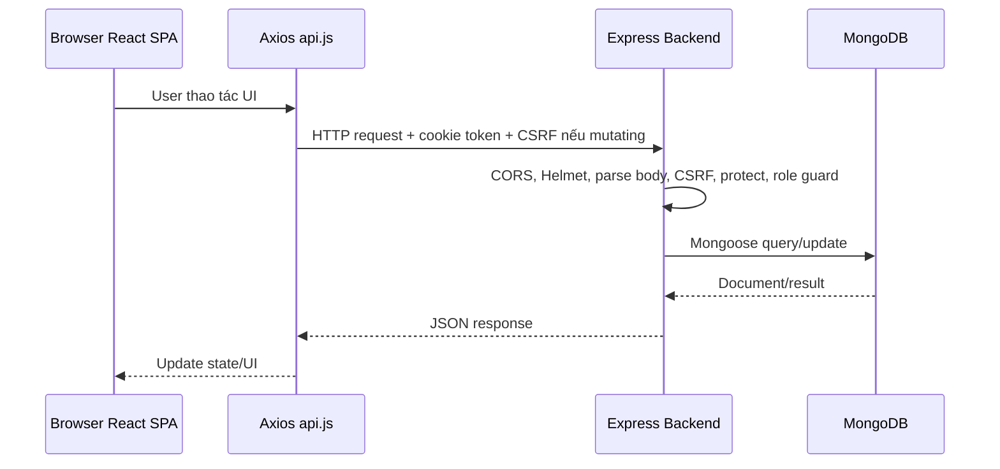
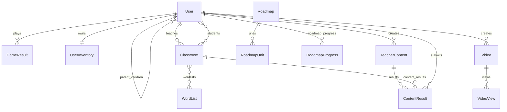
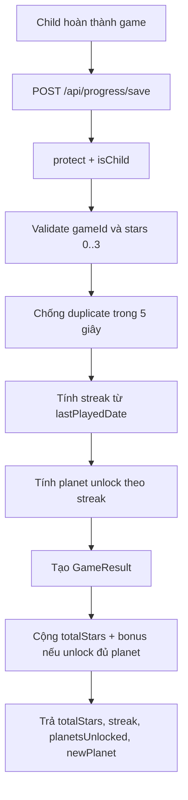
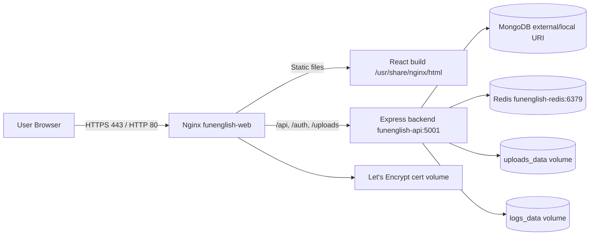

# Fun English - Tài liệu hiểu project

Tài liệu này tổng hợp project hiện tại ở mức kiến trúc: cấu trúc thư mục, backend hoạt động ra sao, dữ liệu đi qua những lớp nào, bảo mật/mã hóa đang dùng gì, topology triển khai như thế nào và nên học project theo thứ tự nào.

## 1. Tổng quan nhanh

Fun English là website học tiếng Anh cho trẻ em. Hệ thống có 4 nhóm người dùng chính:

| Role | Chức năng chính |
|---|---|
| `child` | Chơi game, xem video/story, học roadmap, tích sao, streak, mua đồ trang trí |
| `parent` | Tạo/quản lý tài khoản con, xem tiến độ học của con |
| `teacher` | Tạo lớp học, quản lý học sinh, tạo nội dung game/quiz giao cho lớp |
| `admin` | Quản lý user, duyệt giáo viên/word list, quản lý video, upload media |

Tech stack:

| Layer | Công nghệ |
|---|---|
| Frontend | React 19, Vite 8, React Router 7, Tailwind CSS 4, Axios |
| Backend | Node.js, Express 5, CommonJS |
| Database | MongoDB qua Mongoose |
| Auth | JWT trong HTTP-only cookie, bcrypt password hash, Google OAuth |
| Security | Helmet, CORS allowlist, CSRF HMAC token, rate limiting, role guards |
| Deploy | Docker Compose, Nginx reverse proxy, Redis session store, Let's Encrypt TLS |

## 2. Sơ đồ cấu trúc thư mục

Đây là cây thư mục đã chú thích theo vai trò từng phần. Khi học project, bạn nên đọc từ root config, sang `client`, rồi sang `server`.

```text
english-website-for-kids/
├── README.md                         # Giới thiệu project, tech stack, cách chạy local
├── DEPLOYMENT.md                     # Ghi chú triển khai production
├── package.json                      # Script cấp root: chạy cả client + server
├── package-lock.json                 # Lock dependency cấp root
├── docker-compose.yml                # Chạy production bằng Docker: redis + backend + nginx
│
├── nginx/
│   ├── nginx.http.conf               # Nginx HTTP, dùng giai đoạn lấy SSL cert ban đầu
│   └── nginx.conf                    # Nginx HTTPS, reverse proxy /api /auth /uploads
│
├── public/
│   └── roadmap/
│       └── games/
│           ├── unit1/                # Audio game roadmap unit 1
│           └── unit2/                # Audio game roadmap unit 2
│
├── client/
│   ├── package.json                  # Dependency frontend: React, Vite, Router, Axios...
│   ├── package-lock.json
│   ├── Dockerfile                    # Build React SPA rồi serve bằng Nginx container
│   ├── vite.config.js                # Cấu hình Vite + plugin React/Tailwind
│   ├── vercel.json                   # Cấu hình nếu deploy frontend lên Vercel
│   ├── index.html                    # HTML shell cho React mount vào
│   │
│   ├── public/
│   │   ├── sounds/                   # Nhạc nền, âm thanh mascot, hiệu ứng UI
│   │   ├── story/                    # Video/thumbnail story public
│   │   ├── roadmap/                  # Asset public cho roadmap nếu gọi bằng URL trực tiếp
│   │   ├── icons.svg                 # Sprite/icon public
│   │   └── favicon.svg
│   │
│   └── src/
│       ├── main.jsx                  # Điểm mount React vào DOM
│       ├── App.jsx                   # Bản đồ route frontend theo role
│       ├── App.css
│       ├── index.css                 # Global CSS/Tailwind entry
│       │
│       ├── lib/                      # Helper logic không phụ thuộc UI
│       │   ├── api.js                # Axios baseURL, withCredentials, CSRF interceptor
│       │   ├── roleHome.js           # Chọn trang home tương ứng role
│       │   └── mouseParticles.js
│       │
│       ├── context/
│       │   └── AuthContext.jsx       # Global auth state: user, login, logout, refreshUser
│       │
│       ├── components/               # Component dùng lại nhiều nơi
│       │   ├── Navbar.jsx
│       │   ├── LoginModal.jsx
│       │   ├── ProtectedRoute.jsx    # Guard đăng nhập cơ bản
│       │   ├── LanguageSwitcher.jsx  # Đổi ngôn ngữ vi/en
│       │   ├── ContentPlayer.jsx     # Render nội dung học/video/game
│       │   ├── GameCard.jsx
│       │   ├── StoryCard.jsx
│       │   ├── SongCard.jsx
│       │   ├── SeriesCard.jsx
│       │   ├── PlanetCollection.jsx
│       │   ├── StreakBanner.jsx
│       │   ├── LoadingDots.jsx
│       │   └── guards/
│       │       └── RoleRoute.jsx     # Guard theo role: child/parent/teacher/admin
│       │
│       ├── pages/
│       │   ├── HomePage.jsx          # Trang chính cho guest/child
│       │   ├── LoginPage.jsx
│       │   ├── RegisterPage.jsx
│       │   ├── ForgotPasswordPage.jsx
│       │   ├── OAuthCallbackPage.jsx
│       │   ├── OAuthVerifyPage.jsx
│       │   ├── DashboardPage.jsx     # Dashboard child
│       │   ├── GamePage.jsx          # Wrapper chọn game theo gameId
│       │   ├── AiChatPage.jsx
│       │   ├── RoadmapPage.jsx
│       │   ├── VideosPage.jsx
│       │   ├── StoryPlayerPage.jsx
│       │   ├── CompletionPage.jsx
│       │   ├── CollectionPage.jsx
│       │   ├── ShopPage.jsx
│       │   ├── MyHomePage.jsx
│       │   ├── RoomPage.jsx
│       │   ├── UserProfilePage.jsx
│       │   ├── admin/                # Dashboard, users, approvals, videos, profile
│       │   ├── parent/               # Parent dashboard, child progress
│       │   ├── teacher/              # Teacher dashboard, classroom, content editor
│       │   ├── student/              # Học sinh xem/làm nội dung teacher giao
│       │   └── child/                # Profile riêng của child
│       │
│       ├── games/                    # Mỗi file là một mini game React
│       │   ├── ABCLetters.jsx
│       │   ├── AnimalSounds.jsx
│       │   ├── CleanOceanHero.jsx
│       │   ├── ColorFun.jsx
│       │   ├── CountLearn.jsx
│       │   ├── MatchIt.jsx
│       │   ├── PictureWords.jsx
│       │   ├── SpacePronounce.jsx
│       │   ├── DrawGuess.jsx         # Game dùng AI vision backend
│       │   └── AiChat.jsx            # Game chat với AI backend
│       │
│       ├── hooks/                    # React hooks dùng lại
│       │   ├── useProgress.js        # Gọi API lưu/lấy progress
│       │   ├── useSound.js           # Phát sound effect
│       │   ├── useBgMusic.js         # Nhạc nền
│       │   └── useMouseParticles.js
│       │
│       ├── data/                     # Data tĩnh phía client
│       │   ├── games.js              # Danh sách game hiển thị
│       │   ├── stories.js            # Danh sách story local/public
│       │   └── planets.js            # Data planet hiển thị
│       │
│       ├── i18n/
│       │   ├── index.js              # Setup react-i18next
│       │   └── locales/
│       │       ├── vi.json
│       │       └── en.json
│       │
│       ├── styles/                   # CSS theo page/component lớn
│       └── assets/                   # Ảnh/audio import trực tiếp trong React
│           ├── general/              # Logo, astronaut, star, planet dùng chung
│           ├── shop/                 # Nhà, xe, phòng, item shop
│           ├── roadmap/              # Planet/unit/decorations cho roadmap
│           ├── games/                # Asset theo unit/game
│           └── <game-name>/          # Asset riêng từng game
│
└── server/
    ├── server.js                     # Entry point Express: middleware, routes, MongoDB, listen
    ├── package.json                  # Dependency backend: Express, Mongoose, JWT, bcrypt...
    ├── package-lock.json
    ├── Dockerfile                    # Build backend container, chạy node server.js
    ├── nodemon.json                  # Cấu hình dev reload cho nodemon
    ├── filebeat.yml                  # Cấu hình ship log nếu dùng Filebeat
    │
    ├── config/                       # Cấu hình hạ tầng và security
    │   ├── env.js                    # Load .env.production/.env.development, validate secrets
    │   ├── cors.js                   # Origin allowlist + credentials cookie
    │   ├── cookies.js                # Cookie JWT/session: httpOnly, secure, sameSite
    │   ├── passport.js               # Google OAuth strategy
    │   ├── rateLimiters.js           # Rate limit login, OTP, AI, submit, view
    │   ├── upload.js                 # Multer storage/filter/size limit
    │   ├── email.js                  # Email config nếu dùng service gửi mail
    │   ├── logger.js                 # Logger gốc Pino
    │   └── loggers.js                # Logger theo domain: auth/security/activity...
    │
    ├── middleware/                   # Lớp chặn request trước khi vào route
    │   ├── authMiddleware.js         # protect, requireRole, isAdmin/isTeacher/isParent/isChild
    │   ├── csrf.js                   # Tạo/verify CSRF token bằng HMAC
    │   ├── securityLogger.js         # Log request đáng ngờ, 404 probing, CSRF fail
    │   ├── adminLogger.js            # Log thao tác admin
    │   └── validateObjectId.js       # Chặn param Mongo ObjectId sai format
    │
    ├── models/                       # Mongoose schema, ánh xạ collection MongoDB
    │   ├── User.js                   # Model trung tâm: auth, role, parent/child, stars, streak
    │   ├── GameResult.js             # Kết quả mỗi lần child chơi game
    │   ├── UserInventory.js          # Đồ child đã mua/equip trong shop
    │   ├── Classroom.js              # Lớp học, teacher, joinCode, students
    │   ├── WordList.js               # Danh sách từ vựng teacher/admin
    │   ├── TeacherContent.js         # Game/quiz teacher tự tạo và giao cho lớp
    │   ├── ContentResult.js          # Kết quả student làm TeacherContent
    │   ├── Video.js                  # Video/story/song admin quản lý
    │   ├── VideoView.js              # Lượt xem video
    │   ├── Roadmap.js                # Lộ trình học tổng
    │   ├── RoadmapUnit.js            # Unit/lesson trong roadmap, có question
    │   └── RoadmapProgress.js        # Tiến độ roadmap theo từng child
    │
    ├── routes/                       # API controllers theo domain nghiệp vụ
    │   ├── auth.js                   # Register, login, 2FA OTP, reset password, logout, me
    │   ├── googleAuth.js             # Google OAuth redirect/callback/verify
    │   ├── progress.js               # Save game result, stars, streak, planets, classroom join
    │   ├── shop.js                   # Inventory, buy item, equip item
    │   ├── parent.js                 # Parent quản lý child và xem progress
    │   ├── teacher.js                # Teacher stats, classroom CRUD, profile
    │   ├── teacherContent.js         # Teacher tạo/publish/assign game hoặc quiz
    │   ├── studentContent.js         # Student xem/làm content được giao
    │   ├── admin.js                  # Admin users, approvals, stats, profile
    │   ├── adminVideos.js            # Admin CRUD video
    │   ├── videos.js                 # Public/published video list/detail/view count
    │   ├── upload.js                 # Upload thumbnail, video, avatar
    │   ├── roadmap.js                # Roadmap list/detail/progress/unit complete
    │   ├── analyticsChild.js         # Chart dữ liệu child cho parent
    │   ├── analyticsClass.js         # Chart dữ liệu lớp cho teacher
    │   ├── drawGame.js               # API kiểm tra hình vẽ bằng AI vision
    │   ├── chatGame.js               # API chat AI
    │   ├── transcribe.js             # Upload audio và chuyển giọng nói thành text
    │   └── testLog.js                # Endpoint test logging
    │
    ├── services/                     # Logic dùng lại, không trực tiếp là route
    │   ├── emailService.js           # Gửi OTP email qua Resend
    │   ├── otpService.js             # Tạo/verify OTP và reset token trong memory Map
    │   ├── streakService.js          # Tính streak, unlock planet, bonus stars
    │   └── aiVisionService.js        # Gọi AI vision cho game vẽ
    │
    ├── utils/                        # Helper backend
    │   ├── autoSeedRoadmap.js        # Tự seed roadmap khi server start
    │   ├── passwordPolicy.js         # Rule độ mạnh mật khẩu
    │   └── cache.js                  # Cache helper
    │
    ├── seed/
    │   └── seedRoadmap.js            # Dữ liệu seed roadmap/unit
    │
    ├── scripts/
    │   ├── createAdmin.js            # Tạo admin đầu tiên
    │   └── createTeacher.js          # Tạo teacher bằng script
    │
    ├── uploads/                      # File user/admin upload, backend serve qua /uploads
    │   ├── avatars/                  # Ảnh đại diện user
    │   ├── thumbnails/               # Thumbnail video/story
    │   └── videos/                   # Video upload
    │
    └── logs/                         # Log runtime nếu app ghi ra file
```

Nhìn theo chức năng:

| Muốn hiểu phần nào | Đọc thư mục/file nào trước |
|---|---|
| App mở route nào, role nào được vào | `client/src/App.jsx`, `client/src/components/guards/RoleRoute.jsx` |
| Frontend gọi API ra sao | `client/src/lib/api.js` |
| Login/logout/user state | `client/src/context/AuthContext.jsx`, `server/routes/auth.js` |
| Backend boot và middleware order | `server/server.js` |
| Phân quyền backend | `server/middleware/authMiddleware.js` |
| Database có collection nào | `server/models/` |
| Game cộng sao/streak/planet | `server/routes/progress.js`, `server/services/streakService.js` |
| Parent/teacher/admin workflow | `server/routes/parent.js`, `teacher.js`, `teacherContent.js`, `studentContent.js`, `admin.js` |
| Upload ảnh/video | `server/config/upload.js`, `server/routes/upload.js`, `server/uploads/` |
| Deploy production | `docker-compose.yml`, `nginx/nginx.conf`, `server/Dockerfile`, `client/Dockerfile` |

## 3. Backend hoạt động như thế nào

Entry point là `server/server.js`. Khi server start:

1. Load env qua `server/config/env.js`.
2. Kiểm tra email service.
3. Kết nối MongoDB bằng `mongoose.connect(env.MONGODB_URI)`.
4. Nếu có `REDIS_URL`, tạo Redis session store cho `express-session`; nếu không có thì fallback MemoryStore.
5. Bật `trust proxy` nếu cấu hình production cần proxy.
6. Gắn middleware theo thứ tự:
   - `pinoHttp` log request.
   - `helmet()` set security headers.
   - `cors(corsConfig)` cho phép origin hợp lệ và cookie credentials.
   - `express.json`, `express.urlencoded`, `cookieParser`.
   - JSON parse error handler.
   - `securityLogger`.
   - `express-session` cho OAuth handshake.
   - `passport.initialize()` và `passport.session()`.
   - `csrfMiddleware`.
   - static `/uploads`.
7. Khai báo endpoint `/api/csrf-token` và `/api/health`.
8. Mount toàn bộ API route.
9. Mount `notFoundLogger` và global error handler.
10. Gọi `autoSeedRoadmap()`.
11. `app.listen(env.PORT)`.

Middleware order rất quan trọng: CORS/cookie/body parser phải chạy trước auth/CSRF routes, còn CSRF chạy trước routes để chặn request ghi dữ liệu sai token.

## 4. API modules chính

| Module | Base URL | Mục đích |
|---|---|---|
| Auth | `/api/auth` | Register, login, 2FA OTP, forgot password, switch child, logout, `/me` |
| Google OAuth | `/auth` | Login bằng Google và verify code |
| Progress | `/api/progress` | Lưu kết quả game, sao, streak, unlock planet, join classroom |
| Shop | `/api/shop` | Inventory, mua item, equip item |
| Parent | `/api/parent` | Quản lý con, tạo child, xem progress con, đổi profile/password |
| Teacher | `/api/teacher` | Stats, classroom, học sinh, profile/password |
| Teacher Content | `/api/teacher/contents` | Tạo/sửa/xóa/publish/assign game hoặc quiz |
| Student Content | `/api/student/contents` | Học sinh xem/làm nội dung giáo viên giao |
| Admin | `/api/admin` | Quản lý user, duyệt teacher/wordlist, stats, profile |
| Admin Videos | `/api/admin/videos` | CRUD video bởi admin |
| Videos | `/api/videos` | Danh sách video public/published và tăng view |
| Upload | `/api/upload` | Upload thumbnail/video/avatar |
| Roadmap | `/api/roadmaps` | Roadmap, unit, progress, complete unit |
| Analytics | `/api/children`, `/api/classes` | Chart/summary cho parent/teacher |
| AI Game | `/api/draw-game`, `/api/chat-game`, `/api/transcribe` | AI drawing, chat, audio transcription |

## 5. Frontend hoạt động như thế nào

Frontend là React SPA. Các route được khai báo trong `client/src/App.jsx`.

Luồng khởi động frontend:

1. `main.jsx` render app.
2. `App.jsx` bọc toàn bộ route trong `AuthProvider`.
3. `AuthProvider` gọi `GET /api/auth/me` để biết user hiện tại dựa trên cookie JWT.
4. Route guard trong `RoleRoute.jsx` điều hướng theo role.
5. API call dùng `client/src/lib/api.js`, là Axios instance có:
   - `baseURL = VITE_API_URL` hoặc fallback Render URL.
   - `withCredentials: true` để gửi cookie JWT.
   - request interceptor tự lấy CSRF token trước request `POST/PUT/PATCH/DELETE`.
   - response interceptor refresh CSRF token và retry 1 lần nếu bị lỗi CSRF.

Route frontend theo role:

| Nhóm | Route tiêu biểu |
|---|---|
| Guest/Child | `/`, `/game/:gameId`, `/story/:storyId`, `/videos` |
| Child only | `/dashboard`, `/collection`, `/shop`, `/my-home`, `/my-classrooms`, `/my-content`, `/child/profile` |
| Parent | `/parent/dashboard`, `/parent/child/:childId`, `/parent/profile` |
| Teacher | `/teacher/dashboard`, `/teacher/classroom/:id`, `/teacher/contents`, `/teacher/profile` |
| Admin | `/admin/dashboard`, `/admin/users`, `/admin/approvals`, `/admin/videos`, `/admin/profile` |

## 6. Đường đi dữ liệu tổng quát



Với request cần đăng nhập:

1. Browser gửi request kèm cookie `token`.
2. `protect` trong `authMiddleware.js` lấy token từ cookie `req.cookies.token` hoặc `Authorization: Bearer`.
3. Backend verify JWT bằng `JWT_SECRET`.
4. Backend query `User.findById(...).select("-password")`.
5. Nếu user tồn tại và active, gắn `req.user`.
6. `requireRole(...)` kiểm tra quyền.
7. Route xử lý nghiệp vụ và trả JSON.

## 7. Data model và quan hệ chính



Các model quan trọng:

| Model | Vai trò |
|---|---|
| `User` | Tài khoản mọi role, children, classrooms, stars, streak, planets, trusted devices |
| `GameResult` | Mỗi lần child hoàn thành game: `userId`, `gameId`, `starsEarned`, `completedAt` |
| `UserInventory` | Item đã mua/equip cho nhà, xe, phòng |
| `Classroom` | Lớp của teacher, `joinCode`, danh sách students, word lists |
| `WordList` | Bộ từ vựng giáo viên/admin quản lý |
| `TeacherContent` | Nội dung giáo viên tạo: game/quiz, template, questions/items, assigned classrooms |
| `ContentResult` | Kết quả học sinh làm nội dung giáo viên giao |
| `Video` | Video/story/song, trạng thái publish, thumbnail, creator |
| `VideoView` | Lịch sử view video |
| `Roadmap` | Lộ trình học |
| `RoadmapUnit` | Unit/lesson trong roadmap, có questions |
| `RoadmapProgress` | Tiến độ roadmap theo user và roadmap |

## 8. Luồng đăng ký, đăng nhập và phân quyền

### Register

Có 2 kiểu:

- `POST /api/auth/register-init`: tạo phiên pending OTP, gửi mã qua email.
- `POST /api/auth/register-verify`: verify OTP rồi tạo user.
- `POST /api/auth/register`: legacy endpoint tạo user trực tiếp.

Register public chỉ cho role `parent` hoặc `teacher`. Child không tự đăng ký; child được parent/admin tạo.

### Login

Luồng login:

1. Frontend gửi username/email + password + `deviceId`.
2. Backend tìm user theo username hoặc email.
3. `user.comparePassword(password)` so với bcrypt hash.
4. Nếu user là `child` hoặc không có email: bỏ qua 2FA.
5. Nếu parent/teacher/admin và thiết bị đã trusted: login trực tiếp.
6. Nếu thiết bị mới: gửi OTP email, trả `{ requiresTwoFactor, pendingToken }`.
7. `POST /api/auth/login-verify` xác thực OTP, lưu trusted device hash, set JWT cookie.

JWT được set trong cookie tên `token`. Payload ký hiện tại là `{ id }`, expiry `7d`.

### Role guard

Backend:

- `protect`: yêu cầu JWT hợp lệ.
- `requireRole(...roles)`: kiểm tra `req.user.role`.
- helper: `isAdmin`, `isTeacher`, `isParent`, `isChild`.

Frontend:

- `RoleRoute`: nếu chưa login thì về `/login`, nếu sai role thì về home theo role.
- `GuestOrChild`: guest và child được vào, role khác bị redirect.

## 9. Luồng game/progress/streak

Endpoint chính: `POST /api/progress/save`.



Streak logic nằm ở `server/services/streakService.js`:

- Cùng ngày: giữ streak.
- Ngày kế tiếp: streak + 1.
- Cách từ 2 ngày trở lên: reset về 1 khi save progress, hoặc reset về 0 khi child login nếu quá lâu không chơi.
- Planet unlock theo mốc streak: Mercury 2, Venus 4, Earth 6, Mars 8, Jupiter 10, Saturn 12, Uranus 14, Neptune 16.
- Unlock đủ planet được bonus 50 sao một lần.

## 10. Luồng shop/inventory

Endpoint chính:

- `GET /api/shop/inventory`
- `POST /api/shop/buy`
- `POST /api/shop/equip`

Luồng mua item:

1. Child gửi `itemId`, `itemType`, `price`.
2. Backend kiểm tra item type hợp lệ: `house`, `car`, `room`.
3. Lấy `User.totalStars`.
4. Nếu đủ sao, trừ sao bằng `$inc: { totalStars: -price }`.
5. Thêm item vào `UserInventory.ownedHouses/ownedCars/ownedRooms`.
6. Trả star balance mới.

Lưu ý: giá item lấy từ request body. Nếu muốn bảo mật chặt hơn, nên lấy price từ catalog phía server thay vì tin frontend.

## 11. Luồng teacher/classroom/content

Teacher tạo lớp:

1. `POST /api/teacher/classroom`.
2. Backend tạo `Classroom` có `teacherId = req.user._id`.
3. Push classroom id vào `User.classrooms` của teacher.
4. Classroom có `joinCode` unique để học sinh/phụ huynh join.

Child join classroom:

1. `POST /api/progress/join-classroom` hoặc parent join thay child qua `/api/parent/join-classroom`.
2. Backend tìm classroom theo `joinCode`.
3. Push child id vào `Classroom.students`.
4. Push classroom id vào `User.classrooms`.

Teacher content:

1. Teacher tạo `TeacherContent` dạng `game` hoặc `quiz`.
2. Teacher publish nội dung.
3. Teacher assign vào classroom.
4. Child xem qua `/api/student/contents`.
5. Child complete/submit.
6. Backend tạo `ContentResult`.
7. Teacher xem stats qua `/api/teacher/contents/:id/stats`.

## 12. Luồng roadmap

Roadmap gồm `Roadmap` và nhiều `RoadmapUnit`.

Endpoint:

- `GET /api/roadmaps`: list active roadmap, public.
- `GET /api/roadmaps/:id`: detail roadmap + unit metadata, public.
- `GET /api/roadmaps/:id/progress`: lấy hoặc tạo progress cho child.
- `GET /api/roadmaps/units/:unitId`: lấy unit có questions, cần login child/admin.
- `POST /api/roadmaps/units/:unitId/complete`: đánh dấu complete, cộng stars roadmap, unlock unit kế tiếp.

Khi child chưa có progress, backend tự tạo `RoadmapProgress` và unlock unit đầu tiên `order: 1`.

## 13. Luồng video/upload

Upload:

- Thumbnail: `POST /api/upload/thumbnail`, admin only, tối đa 10 MB.
- Video: `POST /api/upload/video`, admin only, tối đa 500 MB.
- Avatar: `POST /api/upload/avatar`, user đã login, tối đa 5 MB hoặc truyền `avatarUrl`.

Multer lưu file vào:

- `server/uploads/thumbnails`
- `server/uploads/videos`
- `server/uploads/avatars`

Backend serve static qua `/uploads`, còn Nginx proxy `/uploads/` về backend.

Video:

- Admin CRUD video qua `/api/admin/videos`.
- User/guest xem video published qua `/api/videos`.
- View được tăng qua `/api/videos/:id/view`, có rate limit.

## 14. Bảo mật và mã hóa

### Password

Password không được lưu plaintext. Trong `User.js`:

- `pre("save")` hash password bằng `bcrypt.hash(password, 12)`.
- Login dùng `bcrypt.compare(...)`.

Đây là password hashing, không phải encryption. Hash một chiều, không giải mã lại được.

### JWT

Auth token:

- Tạo bằng `jsonwebtoken`.
- Payload `{ id }`.
- Ký bằng `JWT_SECRET`.
- Hết hạn sau 7 ngày.
- Lưu trong cookie `token`.

Cookie options:

- `httpOnly: true`: JavaScript frontend không đọc được cookie.
- `secure: true` ở production.
- `sameSite: none` ở production để dùng cross-origin HTTPS.
- `sameSite: lax` ở development.

### CSRF

CSRF token nằm ở `server/middleware/csrf.js`:

- Endpoint lấy token: `GET /api/csrf-token`.
- Token format: `random.signature`.
- `random` là 32 bytes random hex.
- `signature = HMAC-SHA256(random:hourKey, JWT_SECRET)`.
- Verify cho current hour và previous hour, tức khoảng 1-2 giờ.
- Chỉ enforce cho request ghi dữ liệu nếu có cookie JWT.

Frontend lưu CSRF token trong memory, không lưu localStorage/sessionStorage.

### OTP và reset token

`otpService.js`:

- OTP 6 số.
- Lưu hash OTP bằng SHA-256.
- TTL OTP: 5 phút.
- Tối đa 5 lần nhập sai.
- Reset token TTL: 10 phút.
- Store hiện tại là `Map` trong memory process.

Hệ quả kiến trúc: restart server sẽ mất pending OTP/reset token. Nếu deploy nhiều backend instance, cần chuyển OTP/reset token sang Redis/MongoDB.

### Trusted device

Frontend tạo `deviceId` và lưu localStorage key `funeng_device_id`.

Backend không lưu raw deviceId; backend lưu:

- `SHA-256(deviceId)` trong `User.trustedDevices.tokenHash`.
- Giữ tối đa 10 trusted devices gần nhất.

### CORS

`server/config/cors.js`:

- Development cho phép localhost `5173`, `3000`, `127.0.0.1`.
- Production chỉ cho `CLIENT_URL`.
- `credentials: true` để browser gửi cookie.
- Header cho phép có `X-CSRF-Token`.

### Rate limit

Các limiter chính:

| Limiter | Rule |
|---|---|
| Login | 10 lần / 15 phút / IP |
| Register | 5 lần / 15 phút / IP |
| Forgot password | 5 lần / 15 phút / IP |
| OTP verify | 10 lần / 15 phút / IP |
| OTP resend | 3 lần / 10 phút / IP |
| Quiz submit | 20 lần / phút / IP |
| Video view | 60 lần / phút / IP |
| Draw game | 30 lần / phút / IP |
| Chat game | 30 lần / phút / IP |

### Upload safety

Image whitelist:

- MIME: jpeg, png, webp, gif.
- Extension: `.jpg`, `.jpeg`, `.png`, `.webp`, `.gif`.
- SVG bị loại vì có rủi ro XSS.

Video whitelist:

- mp4, webm, ogg, mov, avi.

### TLS/HTTPS

Ở production, Nginx dùng Let's Encrypt certificate và TLS 1.2/1.3. HTTPS là encryption trên đường truyền. App hiện tại không tự mã hóa dữ liệu ở MongoDB hoặc file upload ở tầng application.

## 15. Topology triển khai

Production Docker Compose:



Container:

| Service | Vai trò |
|---|---|
| `redis` | Session store cho OAuth/session, volume `redis_data` |
| `backend` | Express API, env từ `server/.env.production`, volume uploads/logs |
| `nginx` | Serve React SPA, reverse proxy API/auth/uploads, terminate TLS |

Nginx routes:

| Path | Xử lý |
|---|---|
| `/` | Serve React SPA, fallback `index.html` |
| `/api/` | Proxy tới `http://backend:5001/api/` |
| `/auth/` | Proxy tới `http://backend:5001/auth/` |
| `/uploads/` | Proxy tới `http://backend:5001/uploads/` |
| Static assets | Cache dài hạn vì Vite build có hash filename |

Local development:

```text
Browser -> Vite dev server :5173 -> Express API :5000 -> MongoDB
```

Docker/production:

```text
Browser -> Nginx :80/:443 -> backend :5001 -> MongoDB + Redis
```

## 16. Biến môi trường quan trọng

`server/config/env.js` load:

- `.env.production` nếu `NODE_ENV=production`.
- `.env.development` nếu development.

Biến quan trọng:

| Variable | Ý nghĩa |
|---|---|
| `NODE_ENV` | `development` hoặc `production` |
| `PORT` | Port backend, README local dùng 5000, Docker healthcheck dùng 5001 |
| `MONGODB_URI` | MongoDB connection string |
| `JWT_SECRET` | Secret ký JWT và CSRF HMAC |
| `SESSION_SECRET` | Secret express-session/OAuth |
| `CLIENT_URL` | Origin frontend được CORS allow |
| `RESEND_API_KEY` | Gửi email OTP |
| `EMAIL_FROM` | Email sender |
| `GOOGLE_CLIENT_ID` | Google OAuth |
| `GOOGLE_CLIENT_SECRET` | Google OAuth |
| `GOOGLE_CALLBACK_URL` | Google OAuth callback |
| `COOKIE_SECURE` | Override cookie secure |
| `COOKIE_SAMESITE` | Override sameSite |
| `REDIS_URL` | Redis session store |
| `GROQ_API_KEY` | AI chat game |
| `GROQ_DRAW_API_KEY` | AI draw game |

## 17. Logging và monitoring

Backend dùng Pino:

- `pino-http` log request method/url/status/ip/user-agent.
- `securityLogger` log suspicious requests, CSRF fail, unauthorized access.
- `auth` logger ghi login/register/logout/OTP events.
- Docker mount `logs_data:/app/logs`.
- Có `server/filebeat.yml`, có vẻ chuẩn bị cho log shipping/monitoring.

## 18. Những điểm cần chú ý khi học hoặc sửa code

1. `server/server.js` là bản đồ middleware và route backend.
2. `client/src/lib/api.js` là bản đồ cách frontend gọi backend, đặc biệt CSRF/cookie.
3. `client/src/context/AuthContext.jsx` là state auth toàn app.
4. `server/middleware/authMiddleware.js` là quyền truy cập backend.
5. `server/models/User.js` là model trung tâm nhất.
6. `server/routes/progress.js` là nơi sao/streak/planet thay đổi.
7. `server/routes/teacherContent.js` và `studentContent.js` là luồng giao bài/làm bài.
8. `docker-compose.yml` + `nginx/nginx.conf` là topology production.

Các lưu ý kỹ thuật:

- OTP/reset token đang là memory store, chưa bền vững qua restart.
- `UserInventory` thao tác mua item dựa vào `price` frontend gửi lên; nên cân nhắc server-side price catalog nếu triển khai thật.
- Upload lưu local volume; nếu scale backend nhiều instance thì cần object storage hoặc shared volume.
- App không mã hóa dữ liệu trong database ở tầng application; bảo mật chính hiện tại là TLS trên đường truyền, password hash, cookie HttpOnly, CSRF và role guard.
- Cần đảm bảo `PORT=5001` trong production env nếu dùng Docker healthcheck/Nginx hiện tại.

## 19. Thứ tự học project đề xuất

1. Đọc `README.md` để nắm vai trò user và script chạy.
2. Đọc `client/src/App.jsx` để biết page nào thuộc role nào.
3. Đọc `client/src/context/AuthContext.jsx` và `client/src/lib/api.js` để hiểu login/cookie/CSRF.
4. Đọc `server/server.js` để hiểu middleware order và route registry.
5. Đọc `server/models/User.js`, rồi các model liên quan: `GameResult`, `Classroom`, `TeacherContent`, `ContentResult`, `RoadmapProgress`.
6. Đọc `server/routes/auth.js` để hiểu auth.
7. Đọc `server/routes/progress.js` và `server/services/streakService.js` để hiểu core gamification.
8. Đọc `server/routes/parent.js`, `teacher.js`, `teacherContent.js`, `studentContent.js` để hiểu workflow phụ huynh/giáo viên/học sinh.
9. Đọc `docker-compose.yml` và `nginx/nginx.conf` để hiểu deploy.

## 20. Cheat sheet chạy project

Install dependencies:

```bash
cd client && npm install
cd ../server && npm install
```

Chạy cả frontend và backend từ root:

```bash
npm run dev
```

Chạy riêng:

```bash
cd client && npm run dev
cd server && npm run dev
```

Build frontend:

```bash
npm run build
```

Tạo admin:

```bash
cd server
node scripts/createAdmin.js
```

Health check backend:

```text
GET /api/health
```

## 21. Tóm tắt một câu

Project này là React SPA gọi Express API qua Axios credential cookies; backend dùng JWT cookie + CSRF HMAC + role middleware để bảo vệ route, lưu dữ liệu nghiệp vụ vào MongoDB bằng Mongoose, lưu upload local, dùng Redis cho session OAuth khi production, và được Nginx reverse proxy/serve static trong Docker Compose.
